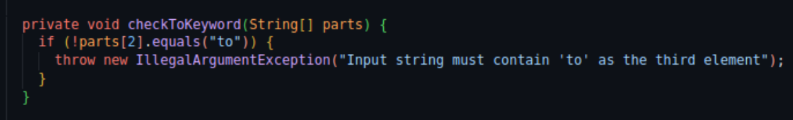

# Reflections

## Naming (Classes/methods/variables)

| Name                       | Explanation                                                                                                                                                                                                                                                                         | Reflection and rules Clean Code |
| -------------------------- | ----------------------------------------------------------------------------------------------------------------------------------------------------------------------------------------------------------------------------------------------------------------------------------- | -------------------------------- |
| UnitConversionQueryParser  | Class name (src/main/java/jensprog/parser)  |    **Class name**: The class name fulfills the book’s "rule" of a noun phrase or a noun. It describes what it parses and what the class is. **Use Pronounceable names**: You can say it easily, but it’s quite long so maybe you could remove the "Query" part of the class name.                              |
| UnitConversionQueryFormatter | Class name (src/main/java/jensprog/formatter)                              |   **Avoid Mental Mapping**: I believe that I could use more clarity in the naming of this class. The purpose of the class is to format and display the conversion between two units. A change to "UnitConversionDisplayFormatter" might be better.                                     |
| convert(double value)      | Method name (src/main/java/jensprog/unitconverter/LengthConverter.java)                         |     **Method names**: The naming is short, but it says what it does. I could be more explicit and create methods for each conversion e.g., "convertMeterToCentimeter" but when using the convert method I believe it shows its action.                                |
| getValue()                 |    Method name (src/main/java/jensprog/parser/UnitConversionQueryParser.java)                                                                                                      |           **Pick One Word per Concept**: The usage of "get" is used across the module. I don’t use "fetch", "retrieve", etc. for different "getter" methods, they use only one word.                           |
| fromUnit                   | Instance variable/parameter (src/main/java/jensprog/unitconverter/LengthConverter.java)                                                        |     **Use Intention-Revealing Names**: The instance variable/parameter could be better in my opinion if I changed it to "fromSourceUnit". I decided to stick to this naming instead because I think it’s clear enough.   |

## Reflection Chapter 2

I have not reflected as much of naming before as I do now when reading the book and also focus on it. It is harder than I expected and so far from my experience, the more a class/method/variable do, the harder it is to give them good descriptive names. I have started creating certain methods (example below) with names I did not like, I understood what the method did but if someone looked at the name of the method, they might not get it immediately. When I created classes or methods with names I thought were good, I felt that someone from the outside don't have to check what the class actually does or what the behaviour of the method is, since the naming was good.

Before reading the book I have not thought about nouns and verbs, why it's better that classes have nouns and methods have verbs.

A good example of bad naming (which is now removed) is this method that is suppose to check the array of strings for the "to" word. I had no clue how to name the method well, so to maybe understand what it does you had to check inside the method. 

## Methods

| Method name              | Screenshot                                                    | LOC | Reflection and rules Clean Code |
|---------------------------|---------------------------------------------------------------|-----|---------------------------------|
| TemperatureConverter.convert(double value)     |  | 17  | **Do One Thing**: This method does more than one thing(arguebly), it uses a lot of nested if-statements between different temperature units. I kept it that way instead of separating the method into multiple methods, which is better of course. |
| SpeedConverter.convert(double value)     |       | 17  | **Function Arguments**: Only takes one argument which is necessary for the calculations that the method does. **Small!**: Methods should be small, I know I could do these calculations in multiple methods but I kept the method as is because it is not a method that is hard to understand, but could benefit from improving the readability to make it even easier to read |
| scanNextToken(int position) |           | 12  | **Blocks And Indenting**: I use multiple if-statements in this method and I know that I could create multiple methods, I don't follow the "one line long" but since every if-block returns something directly I thought I could keep it that way. |
| scanNumber(int position)  |                | 18  | **Use Descriptive Names**: The method have in my opinion a good name. It checks the input string for numbers. But, it's not a great name. I could change the methods name to "scanInputStringForNumbers" and that would've been better from a understandability perspective. |
| scanWord(int position)    |                  | 13  | **Common Monadic Forms**: I only use one argument for this method and that argument is the position of the word in the input string, this is needed to be able to know where the word is located.|
|UnitConversionQueryParser.getValue() | | 3 | **Have No Side Effects**: The getValue() method doesn't have any side effects since it doesn't alter anything, it just returns data. |

## Reflection Chapter 3

When I created the table of different methods and used some of the principles from chapter 3, I realized that I mostly found things that I could do better. Better method names, branching the methods into multiple smaller methods etc. One thing I've learned is that it is easier to create a method if you write the methods responsibilies beforehand, if you just keep everything in your head and then start implementing, often the method will do more than 1 thing. Of course as a beginner, Co-pilot will help adding functionality/validation etc in methods as well and it might seem fine to begin with, but after a while when really analyzing the method, you can see that you could make it more understandable. Which is good, that I can see that something can be better than it is.

One thing I will say that I don't really agree with, and that's a part of why I kept the method as is. The convert-method of TemperatureConverter and SpeedConverter (linked in the table above) is full of nested if-statements, if I would ask the Robert C. Martin about it, he would've said that it does more than one thing. I can understand that point of view, but also it does only one thing in my opinion since it does convert different temperature & speed units. I would agree with the readability and understandability aspect of using multiple methods for each unit conversion, but from a "Do one thing" perspective I think you can argue that my implemenation does one thing.
